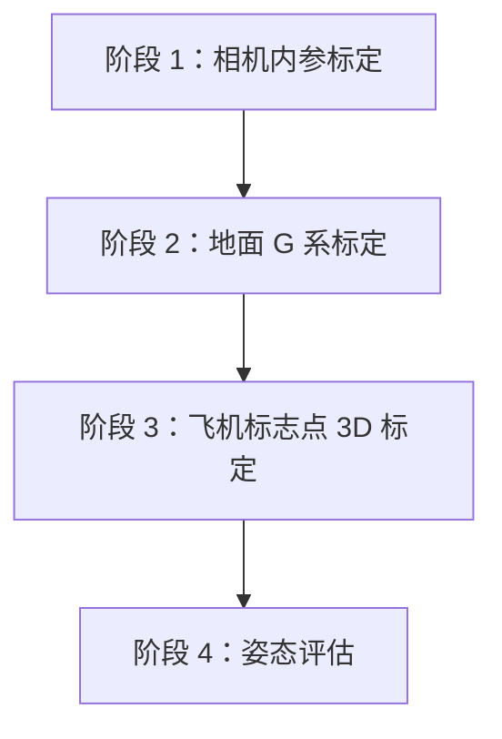

# 基于地面标志点坐标系的飞机姿态评估流程：修改清单

**目标**：将项目由旧版“标定板定义地面坐标系”的链路，迁移为以下可复现的四阶段流程，并在每个阶段输出实际结果和可量化误差。



## 1. 总体改造原则

1. **标定板仅用于相机内参标定**，不再承担最终的地面世界坐标系定义。
2. 以布设在地面上的、坐标经实测的标志点定义地面坐标系 `G`：明确原点、X/Y/Z 轴、单位和每个标志点 ID。
3. 所有多视图三角化和最终姿态结果都使用地面坐标系 `G`。
4. 每个阶段都同时输出：
   - 可供下一阶段调用的结果文件；
   - 机器可读的 JSON/CSV 质量报告；
   - 人可检查的可视化图或残差图。
5. 坐标变换命名必须统一。建议使用 `A_T_B` 表示将 B 系坐标转换至 A 系；例如 `C_T_G`、`G_T_B`。

## 2. 阶段级输入、输出与误差定义

| 阶段 | 输入 | 核心输出 | 必须报告的误差 / 质量指标 |
|---|---|---|---|
| 1. 相机内参标定 | 多张标定板图像、标定板点坐标 | `camera_intrinsics.npz`：`K`、`dist`、图像尺寸 | 总 RMS、逐图重投影 RMSE、检测点数、有效/剔除图像数、剔除原因、残差可视化 |
| 2. 地面 G 系标定 | 内参、地面标志点 3D 坐标、各视图 2D 检测 | 每帧 `C_T_G` | PnP RMSE、最大误差、内点数/比例、地面平面拟合残差、跨视角一致性 |
| 3. 飞机标志点 3D 标定 | 多视图飞机点 2D 观测、阶段 2 的 `C_T_G` | `aircraft_points_G.yaml`、`aircraft_points_B.yaml`、`G_T_B` | 每点观测数、三角化夹角、重投影误差、BA 前后误差、刚体距离残差、坐标回环误差 |
| 4. 姿态评估 | 内参、地面位姿、机体系点坐标、单帧飞机点 2D 观测 | `G_T_B`、位置、yaw/pitch/roll | 飞机 PnP RMSE/max、内/外点状态、重复性 std/p95、失败率；有外部真值时的真实旋转误差 |

## 3. 文件级修改清单

### 3.1 保留并增强：内参标定

| 文件 | 修改 | 验收条件 |
|---|---|---|
| `tools/run_calibration.py` | 保留现有标定流程；新增 `calibration_report.json` 与 `calibration_report.csv`。每幅图记录检测点数、是否采用、单图 RMSE 与剔除原因；总体记录 `K`、`dist`、全局 RMS、图像尺寸与有效图数。 | 报告能定位任意一张坏图；输出的内参与畸变可被后续脚本直接读取。 |
| `sls_calib/camera_calib.py` | 将逐图残差、有效图索引和失败原因作为结构化返回值暴露给调用方。必要时增加残差图生成接口。 | `run_calibration.py` 无需重复计算即可生成完整报告。 |
| `configs/board_points.yaml` | 更名为 `configs/calibration_board_points.yaml`；坐标系字段由 `G` 改为 `CALIB_BOARD`。 | 文件语义明确：该标定板不再定义地面世界坐标。 |

### 3.2 新增并替换：地面坐标系标定

| 文件 | 修改 | 验收条件 |
|---|---|---|
| `configs/ground_markers_G.yaml`（新增） | 定义 `G` 系：单位、原点、轴方向、地面法向、标志点 ID 与实测三维坐标。建议至少 6 个、覆盖足够大的区域，避免近共线布局。 | 任一 ID 的三维坐标来源可追溯；坐标系方向唯一且文档化。 |
| `tools/estimate_board_pose.py` | 重构并更名为 `tools/estimate_ground_pose.py`。不再读取标定板圆点；读取地面标志点 2D/3D 对应，采用 `solvePnPRansac` + LM 精修求解 `C_T_G`。 | 每个有效视图输出一组 `C_R_G`、`C_t_G`；图像上可投影 G 轴进行直观检查。 |
| `sls_calib/ground_pose.py`（建议新增） | 抽取 `GroundPoseEstimator`，统一地面点加载、RANSAC PnP、重投影误差与报告生成，避免同一逻辑散落在多个工具脚本。 | 阶段 2、3、4 都可加载同一种 pose 文件格式。 |
| `output/<session>/stage_02_ground_poses.json`（新增） | 对每个图像保存 ID、`C_T_G`、内点掩码、RMSE、max error、检测点数与时间戳。 | 三角化阶段无需再次估计地面位姿。 |

### 3.3 改造：飞机标志点三维标定与机体系构建

| 文件 | 修改 | 验收条件 |
|---|---|---|
| `tools/triangulate_aircraft_points.py` | 将内部的 `BoardPoseEstimator` 删除或替换为读取阶段 2 的 `GroundPoseEstimator` / `stage_02_ground_poses.json`。保留 Huber BA、观测数统计、三角化夹角和重投影误差。 | 输出的飞机点明确处于 `G` 系；不再隐式依赖标定板坐标。 |
| `tools/convert_to_B_frame.py` | 保留由 `aircraft_points_G` 构建机体系 `B` 的功能；显式输入/输出路径。新增正交性、`det(R)`、G→B→G 回环误差、关键结构距离残差。 | `G_T_B` 是正交刚体变换，`det(R)` 接近 1，回环误差接近数值精度。 |
| `aircraft_points_G.yaml` / `aircraft_points_B.yaml` | 统一写入 `coordinate_system`、点 ID、单位、生成时间、来源 session。 | 后续 PnP 不依赖人工猜测点顺序或坐标系。 |
| `output/<session>/stage_03_aircraft_calibration_report.json`（新增） | 记录每点观测数、平均/最大重投影误差、夹角、BA 前后代价、剔除观测、刚体检查结果。 | 可追踪飞机点标定的薄弱点并针对性补拍。 |

### 3.4 修正并增强：姿态评估

| 文件 | 修改 | 验收条件 |
|---|---|---|
| `tools/estimate_aircraft_pose.py` | 保留 RANSAC + LM；输出每个飞机点的 2D 残差、内/外点状态和最终 `pose_report.json`。当内点不足时给出明确失败原因。 | 单帧结果能说明“用了哪些点、误差多大、是否可信”。 |
| `tools/compose_aircraft_pose.py` | 输入改为 ground pose；调用 `sls_calib/transforms.py` 中的 `compose_G_T_B()` 与 `R_to_euler()`，不要自行再实现欧拉角转换。重点检查现有代码的轴顺序：函数若返回 roll/pitch/yaw，调用端不得按 yaw/pitch/roll 解包。 | 输出的姿态是“飞机相对地面 G 系”的姿态；用已知旋转测试验证三个轴没有互换。 |
| `tools/evaluate_repeatability.py` | 保留 yaw/pitch/roll 标准差、总旋转角标准差、p95、失败率；字段改为 `ground_rmse`，同时汇总 PnP 内点数与观测条件。 | 同一静态姿态的多次测量可以给出重复性结论。 |
| `tools/visualize_axes.py` | 将 Board 文案和图层替换为 Ground；同时显示地面标志点、地面 G 轴、飞机点、机体 B 轴，以及 ground/aircraft 两类 RMSE。 | 一张图即可人工核查两类坐标轴和主要重投影误差。 |

### 3.5 编排与文档

| 文件 | 修改 | 验收条件 |
|---|---|---|
| `tools/run_pipeline.py` | 按四阶段重写编排，显式声明阶段输入、产物目录和失败停止条件。 | 从空的 session 目录可顺序运行，且每一步只依赖前一步的明确输出。 |
| `configs/experiment_ground_pipeline.yaml`（新增） | 集中配置相机文件、地面点配置、飞机点观测、输出 session、RANSAC 阈值、质量门限。 | 实验参数可复现实验而不需改代码。 |
| `README.md` | 删除/下沉旧版 “SfM + ArUco” 通用流程，改写为四阶段命令、目录结构、坐标约定和质量门限解释。 | 新成员可仅依 README 完成一次实验。 |

## 4. 推荐的输出目录

```text
output/<session>/
├── stage_01_intrinsics.npz
├── stage_01_calibration_report.json
├── stage_01_reprojection_residuals.png
├── stage_02_ground_poses.json
├── stage_02_ground_pose_report.json
├── stage_02_ground_axes/
├── stage_03_aircraft_points_G.yaml
├── stage_03_aircraft_points_B.yaml
├── stage_03_aircraft_calibration_report.json
├── stage_04_pose_results.jsonl
├── stage_04_pose_report.json
└── stage_04_repeatability_report.json
```

`JSONL` 适合逐帧追加姿态结果；阶段汇总使用 JSON，便于程序读取和人工检查。

## 5. 统一质量报告建议字段

所有 `stage_XX_*_report.json` 建议包含：

```json
{
  "session_id": "2026-07-27_trial_01",
  "stage": "ground_pose",
  "status": "pass",
  "inputs": {},
  "outputs": {},
  "metrics": {
    "rmse_px": 0.0,
    "max_error_px": 0.0,
    "inlier_count": 0,
    "inlier_ratio": 0.0
  },
  "thresholds": {},
  "warnings": [],
  "failed_items": []
}
```

除共享字段外，阶段 1 增加 `per_image_metrics`；阶段 3 增加 `per_point_metrics` 与 `bundle_adjustment`；阶段 4 增加 `per_marker_residuals`、`position_G`、`euler_deg` 和重复性统计。

## 6. 实施优先级

1. **P0：坐标系迁移正确性**
   - 新建 `ground_markers_G.yaml`；
   - 实现 `estimate_ground_pose.py` 并稳定输出 `C_T_G`；
   - 将 `triangulate_aircraft_points.py` 的位姿来源切换到阶段 2 输出；
   - 修正 `compose_aircraft_pose.py` 的欧拉角顺序。
2. **P1：结果与误差可追溯**
   - 为四阶段实现结构化报告；
   - 将每个标志点/每幅图像的残差暴露出来；
   - 更新可视化和重复性评估。
3. **P2：实验可复现与鲁棒性**
   - 重写 `run_pipeline.py` 与 README；
   - 配置化全部阈值；
   - 增加单元测试与已知位姿的端到端测试。

## 7. 数据采集与实验建议

- 地面标志点应大范围分布，避免集中、共线或几乎共面退化以外的几何退化；所有点虽然在地面平面上，但其二维布局必须覆盖拍摄区域。
- 用于飞机姿态 PnP 的点建议固定使用 **至少 8 个**非对称、空间分散的点。现有 6 个点正好等于最低内点要求，鲁棒余量不足。
- 飞机点三角化的视角需要足够基线；对夹角过小、观测次数过少和重投影残差过大的点应拒绝或补拍。
- 所有照片和检测结果都应带 session、相机、焦距/镜头、分辨率等元数据，防止不同内参或不同地面配置混用。

## 8. 误差解释边界

重投影误差低、重复性好，只能证明系统在当前数据上的**内部一致性和稳定性**；它们不等价于绝对姿态准确度。

若需要声明例如 **1/60°（1 arcmin）绝对角度精度**，必须引入独立真值：已知倾角治具、编码器、高精度电子水平仪，或经溯源的外部测量系统。最终应报告：

\[
\theta_{err}=\cos^{-1}\left(\frac{\mathrm{trace}(R_{gt}^{T}R_{est})-1}{2}\right)
\]

并按 yaw/pitch/roll 分量和总旋转角分别统计均值、标准差、p95 与最大值。

## 9. 最终验收清单

- [ ] 标定板文件仅被阶段 1 使用，地面 `G` 系由实测地面标志点唯一确定。
- [ ] 每帧相机位姿 `C_T_G` 有来源、内点掩码和重投影误差。
- [ ] 飞机点三角化只使用阶段 2 产生的地面位姿。
- [ ] `G_T_B`、欧拉角轴顺序和单位都有明确的自动测试。
- [ ] 四阶段均生成结果文件、JSON 报告和可视化输出。
- [ ] 重复性与绝对精度的定义未混淆；若主张绝对精度，已接入独立真值实验。
- [ ] README 能复现完整的四阶段实验并解释每个质量门限。
